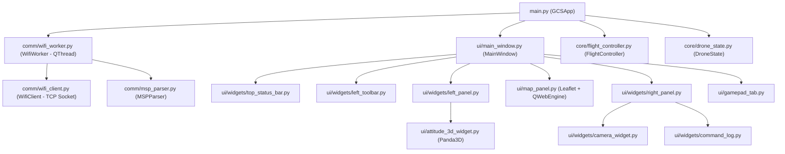

# 🛸 Drone GCS — Báo cáo Review toàn bộ dự án

> **Ngày review:** 2026-05-01  
> **Trạng thái:** Chỉ đọc — chưa sửa bất kỳ file nào

---

## 1. Tổng quan kiến trúc



**Stack:** PySide6 (Qt) + Panda3D (3D attitude) + QWebEngine (Leaflet map + instruments) + TCP Socket (ESP32 ↔ INAV FC)

---

## 2. Danh sách chức năng hiện có

| # | Chức năng | File chính | Trạng thái |
|---|-----------|-----------|------------|
| 1 | Kết nối WiFi TCP ↔ ESP32 | `wifi_client.py`, `wifi_worker.py` | ✅ Hoàn thiện |
| 2 | Mock mode (giả lập không cần phần cứng) | `wifi_worker.py` | ✅ Hoàn thiện |
| 3 | Giải mã giao thức MSP (7 loại lệnh) | `msp_parser.py` | ✅ Hoàn thiện |
| 4 | ARM / DISARM (chờ RC link INAV) | `flight_controller.py` | ✅ Hoàn thiện |
| 5 | NAV Takeoff & Hold (ALTHOLD + POSHOLD) | `flight_controller.py` | ✅ Hoàn thiện |
| 6 | Manual Takeoff (ANGLE → Ramp → NAV) | `flight_controller.py` | ✅ Hoàn thiện |
| 7 | Safe Land (tắt NAV trước → bật AUX3) | `flight_controller.py` | ✅ Hoàn thiện |
| 8 | RTH — Return To Home | `flight_controller.py` | ✅ Hoàn thiện |
| 9 | Force DISARM / Force Safe Land (Emergency) | `flight_controller.py` | ✅ Hoàn thiện |
| 10 | Mission Waypoint Upload (MSP_SET_WP) | `flight_controller.py`, `map_panel.py` | ✅ Hoàn thiện |
| 11 | Failsafe config (RTH/Ignore khi mất WiFi) | `flight_controller.py` | ✅ Hoàn thiện |
| 12 | Bản đồ Leaflet + drone marker real-time | `map_panel.py`, `assets/map.html` | ✅ Hoàn thiện |
| 13 | Click-to-add waypoint trên bản đồ | `map_panel.py` (WebBridge) | ✅ Hoàn thiện |
| 14 | Telemetry dashboard (20+ thông số) | `left_panel.py`, `main.py` | ✅ Hoàn thiện |
| 15 | 3D Attitude Widget (Panda3D + GLB model) | `attitude_3d_widget.py` | ✅ Hoàn thiện |
| 16 | Compass + ADI instruments (HTML/JS) | `instruments.html`, `left_panel.py` | ✅ Hoàn thiện |
| 17 | Virtual Gamepad Controller | `gamepad_tab.py` | ✅ Hoàn thiện |
| 18 | Emergency Overlay (fade in/out) | `emergency_overlay.py` | ⚠️ Có bug |
| 19 | PING/PONG latency measurement | `wifi_worker.py`, `main.py` | ✅ Hoàn thiện |
| 20 | Command Log (500 dòng, HTML formatted) | `command_log.py` | ✅ Hoàn thiện |
| 21 | Camera Live Feed | `camera_widget.py` | 🔲 Placeholder |
| 22 | Config Tab (PID, Rate, Sensor) | `config_tab.py` | 🔲 Placeholder |
| 23 | Cảnh báo khoảng cách drone → Home | `main.py` | ✅ Hoàn thiện |
| 24 | GPS Moving Average (anti-drift) | `drone_state.py` | ✅ Hoàn thiện |
| 25 | ESP32 firmware | `ESP32/main.py` | ✅ Có code |

---

## 3. 🔴 BUG CẦN SỬA NGAY

### BUG-1: `emergency_overlay.py` — Tham chiếu `self._opacity_effect` không tồn tại

> [!CAUTION]
> **Crash tại runtime** khi gọi `hide_overlay()`

[emergency_overlay.py:L215](file:///d:/Droneeee_Fake/ui/emergency_overlay.py#L215):
```python
def _on_fade_out_done(self):
    if self._fade_out_connected:
        self._fade_anim.finished.disconnect(self._on_fade_out_done)
        self._fade_out_connected = False
    if self._opacity_effect.opacity() < 0.05:  # ❌ _opacity_effect CHƯA BAO GIỜ ĐƯỢC KHAI BÁO
        self.hide()
```

Code đã refactor từ `QGraphicsOpacityEffect` sang custom property `overlayOpacity`, nhưng **quên cập nhật** `_on_fade_out_done()`. Cần đổi thành:

```python
if self._current_opacity < 0.05:
    self.hide()
```

---

### BUG-2: `main.py` — Import `haversine_distance` bên trong hàm (dòng 609)

[main.py:L609](file:///d:/Droneeee_Fake/main.py#L609):
```python
from ui.map_panel import haversine_distance  # Import trong loop telemetry 20Hz!
```

Import bên trong hàm `update_telemetry_ui()` — hàm này chạy **20 lần/giây**. Python cache module import nên không crash, nhưng đây là **code smell** nghiêm trọng và vi phạm convention.

---

### BUG-3: `drone_state.py` — `reset()` thiếu reset các field sensor & ping

[drone_state.py:L95-L143](file:///d:/Droneeee_Fake/core/drone_state.py#L95-L143):

Hàm `reset()` bỏ quên các field:
- `surface_altitude`, `surface_quality`, `has_valid_surface`
- `sensor_opflow`, `sensor_rangefinder`, `sensor_mag`, `sensor_gps`, `sensor_baro`
- `system_load`
- `ping_rtt_ms`
- `_gps_history` (deque)

Khi disconnect rồi reconnect, **dữ liệu sensor cũ sẽ tồn tại** → UI hiển thị sai.

---

### BUG-4: `msp_parser.py` — Buffer bị cắt 2 lần trùng lặp

[msp_parser.py:L196-L203](file:///d:/Droneeee_Fake/comm/msp_parser.py#L196-L203):
```python
# Lần 1:
if len(self.buffer) > MAX_BUFFER_SIZE:
    self.buffer = self.buffer[-1024:]

# Lần 2 (ngay sau, redundant!):
if len(self.buffer) > MAX_BUFFER_SIZE:
    self.buffer = self.buffer[-MAX_BUFFER_SIZE:]
```

Lần cắt thứ 2 sẽ **không bao giờ chạy** vì lần 1 đã cắt buffer xuống 1024 bytes (< MAX_BUFFER_SIZE = 4096). Đây là dead code / copy-paste lỗi.

---

## 4. ⚠️ VẤN ĐỀ THIẾT KẾ & TỐI ƯU

### 4.1 `main.py` quá lớn — God Object anti-pattern

> [!WARNING]
> File `main.py` có **1102 dòng** và class `GCSApp` chứa **toàn bộ logic** điều phối

- `ConnectionDialog` + `TakeoffDialog` nên tách ra file `ui/dialogs/`
- `update_telemetry_ui()` (dòng 361-619) là **hàm 260 dòng** — quá dài, nên tách theo nhóm data
- Logic gamepad RC (`_tick_gamepad_rc`) nên nằm trong `gamepad_tab.py` hoặc module riêng
- Logic mission (`_upload_mission`, `_start_mission`, `_stop_mission`) nên tách ra `mission_controller.py`

### 4.2 `flight_controller.py` — State machine monolithic

> [!IMPORTANT]
> File 1431 dòng, 18+ states, `_tick()` là chuỗi if/elif dài

- **Nên refactor** sang dictionary dispatch hoặc State pattern
- Hàm `_haversine_m()` trùng lặp với `haversine_distance()` trong `map_panel.py`
- `time.sleep(self.WP_UPLOAD_DELAY_S)` trong `upload_mission()` **block Main Thread** (dòng 494) — nên dùng QTimer hoặc chuyển sang worker thread

### 4.3 Các file UI "mồ côi" — không được dùng

| File | Lý do |
|------|-------|
| [dashboard_tab.py](file:///d:/Droneeee_Fake/ui/dashboard_tab.py) | Đã bị thay thế bởi `left_panel.py` — không import ở đâu |
| [manual_control_tab.py](file:///d:/Droneeee_Fake/ui/manual_control_tab.py) | Đã bị thay thế bởi `gamepad_tab.py` — chỉ import trong `_send_manual_rc()` nhưng không bao giờ gọi |
| [mission_tab.py](file:///d:/Droneeee_Fake/ui/mission_tab.py) | File 32KB — đã bị thay thế bởi `map_panel.py` |
| `ESP32/main_backup.py`, `ESP32/main_fixed.py` | Backup files không cần thiết |

### 4.4 `update_telemetry_ui()` — Inline stylesheet lặp lại

Toàn bộ hàm `update_telemetry_ui()` dùng `setStyleSheet()` inline mỗi lần nhận data mới (20Hz). Mỗi lần gọi `setStyleSheet()`, Qt phải **re-parse CSS string** → tốn CPU không cần thiết.

**Giải pháp:** Dùng class-level color constants + chỉ set style khi giá trị thay đổi ngưỡng.

### 4.5 `wifi_worker.py` — `_extract_text_responses()` duyệt byte-by-byte

[wifi_worker.py:L266-L298](file:///d:/Droneeee_Fake/comm/wifi_worker.py#L266-L298):

Binary MSP data bị copy **từng byte** vào `msp_parts` list rồi join:
```python
msp_parts.append(data[i:i+1])  # Tạo slice object cho MỖI byte!
i += 1
```
Với data ~1KB/frame × 20Hz = 20KB/s, tạo **hàng nghìn slice object mỗi giây**. Nên dùng `bytearray` và bulk copy.

### 4.6 `_send_manual_rc()` tạo `MSPParser()` mới mỗi lần gọi

[main.py:L940-L943](file:///d:/Droneeee_Fake/main.py#L940-L943):
```python
from comm.msp_parser import MSPParser
parser = MSPParser()  # Tạo parser MỚI mỗi lần gọi!
frame = parser.pack_set_raw_rc(channels)
```
Nên dùng `self.flight_controller._parser` có sẵn, hoặc tạo instance một lần.

### 4.7 Duplicate `_clamp()` function

- `main.py:L39` — `_clamp(value, minimum, maximum)`
- `gamepad_tab.py:L22` — `_clamp(value, minimum, maximum)`

Cùng logic, nên đặt vào `utils.py` chung.

### 4.8 `main_window.py` — Tạo `ConfigTab()` mới mỗi lần mở Settings

[main_window.py:L304-L306](file:///d:/Droneeee_Fake/ui/main_window.py#L304-L306):
```python
config = ConfigTab()  # Tạo mới mỗi lần click Settings!
layout.addWidget(config)
dialog.exec()
```

Ngoài ra, `self.config_tab = ConfigTab()` ở dòng 275 **không bao giờ được dùng** (tạo rồi bỏ).

### 4.9 `_js_update_waypoints()` — Double JSON encode

[map_panel.py:L399-L400](file:///d:/Droneeee_Fake/ui/map_panel.py#L399-L400):
```python
wp_json = json.dumps(self._waypoints)
self._run_js(f"updateWaypoints({json.dumps(wp_json)});")
```

`json.dumps()` gọi **2 lần**: lần 1 convert list → JSON string, lần 2 convert JSON string → escaped JSON string. JS nhận string thay vì array → cần `JSON.parse()` phía JS. Nên sửa thành `self._run_js(f"updateWaypoints({wp_json});")`.

### 4.10 Thread safety — `DroneState` không có lock

> [!NOTE]
> Comment ghi "truy cập trên Main Thread qua Signal/Slot nên không cần lock"

Đúng cho trường hợp hiện tại, **nhưng** `wifi_worker.py` mock mode ghi trực tiếp `_mock_channels`, `_mock_armed` từ worker thread trong khi main thread đọc → potential race condition nếu mở rộng trong tương lai.

### 4.11 `left_toolbar.py` — ARM button không đổi style

[left_toolbar.py:L241-L258](file:///d:/Droneeee_Fake/ui/widgets/left_toolbar.py#L241-L258):

`set_arm_state()` dùng **cùng một style** `_BTN_DANGER_STYLE` cho cả ARM và DISARM → người dùng không phân biệt trạng thái bằng mắt.

### 4.12 `motor` bars trong `left_panel.py` — không tồn tại

[main.py:L476-L481](file:///d:/Droneeee_Fake/main.py#L476-L481) truy cập `lp.bar_motor1`, `lp.val_motor1`, nhưng **left_panel.py không khai báo** các widget motor bars. Code này sẽ **silent fail** vì dùng `getattr(..., None)`.

---

## 5. 📁 Files thừa / Dead Code

| File/Code | Vấn đề |
|-----------|--------|
| `ui/dashboard_tab.py` (243 dòng) | Không import ở đâu — dead file |
| `ui/manual_control_tab.py` (132 dòng) | Chỉ reference trong `_send_manual_rc()` — never called từ UI |
| `ui/mission_tab.py` (32KB) | Đã thay thế bởi `map_panel.py` |
| `ESP32/main_backup.py` | Backup thừa |
| `ESP32/main_fixed.py` | Backup thừa |
| `main.py:_send_manual_rc()` | Dead code — không nút nào gọi hàm này |
| `main.py:_hold_position()` | Dead code — không nút nào gọi |
| `main.py:_confirm_manual_takeoff()` | Dead code — không nút nào gọi |

---

## 6. 🔒 Vấn đề an toàn bay

### 6.1 `upload_mission()` gọi `time.sleep()` trên Main Thread

**Nguy hiểm:** Khi upload >20 waypoints, Main Thread bị block → UI đơ → **Emergency DISARM không click được** trong thời gian upload.

### 6.2 Không có kiểm tra pin trước khi bay

Không có logic cảnh báo khi pin thấp (< 20%) trước ARM/Takeoff. Drone có thể cất cánh rồi rơi vì hết pin.

### 6.3 Không có geofence

Chỉ có cảnh báo khoảng cách 1 lần (`_distance_warning_shown`), không có hard limit ngăn drone bay quá xa.

---

## 7. 📊 Tổng hợp

| Loại | Số lượng |
|------|---------|
| 🔴 Bug cần sửa ngay | 4 |
| ⚠️ Vấn đề thiết kế | 12 |
| 📁 Dead code/files | 8 |
| 🔒 Vấn đề an toàn | 3 |

---

## 8. Đề xuất ưu tiên sửa

1. **Sửa BUG-1** (`_opacity_effect` crash) — 1 dòng
2. **Sửa BUG-3** (`reset()` thiếu fields) — 10 dòng
3. **Xóa dead files** (`dashboard_tab.py`, `manual_control_tab.py`, `mission_tab.py`)
4. **Tách `main.py`** — dialog ra `ui/dialogs/`, mission logic ra module riêng
5. **Fix `upload_mission()` blocking** — chuyển sang async hoặc QTimer
6. **Fix double JSON encode** trong `map_panel.py`
7. **Thêm battery guard** trước ARM/Takeoff
